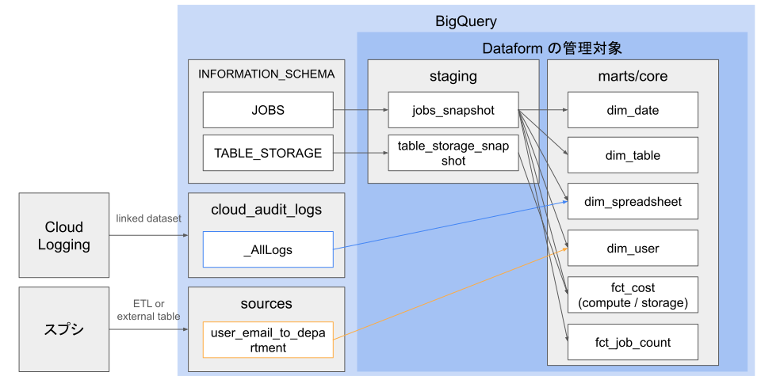
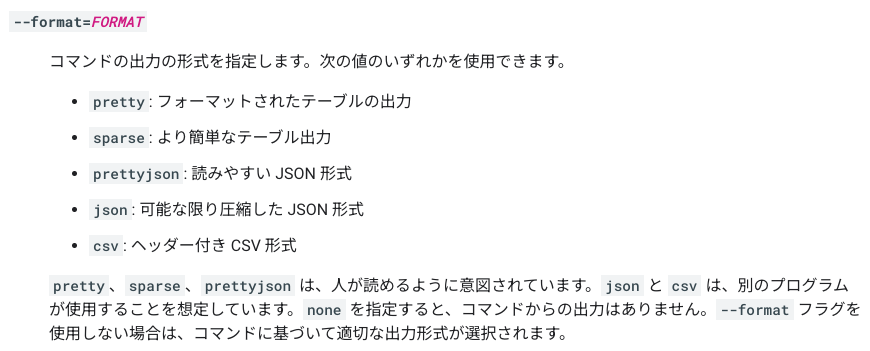
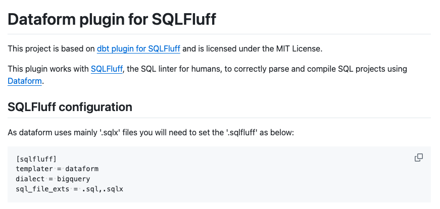
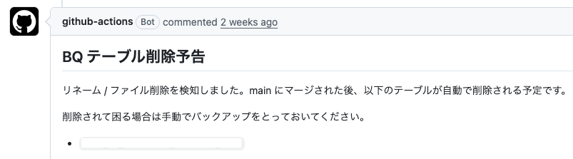
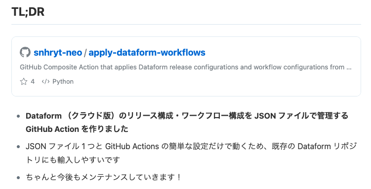
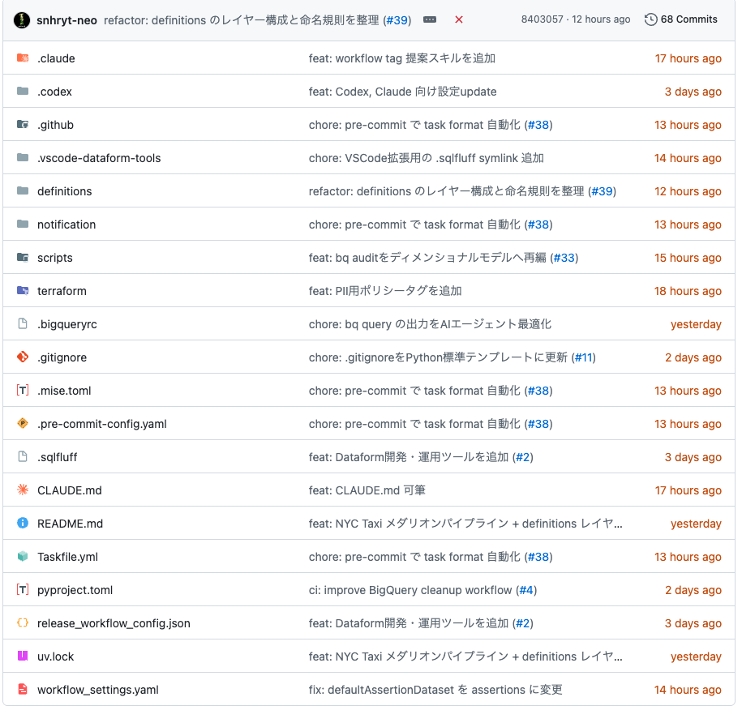

<style>
@import url("./deck.css");
</style>

<!-- _class: title -->

# Dataformのリポジトリを立ち上げるときに<br>まずやること

品原 悠杜 ([@snhrytdesu](https://x.com/snhrytdesu))
Dataform Meetup #2 (2026-06-08)

---

# 本日話すこと
<!-- _class: lead -->

- 直近 BigQuery x Dataform でデータ基盤をゼロから立ち上げる機会があった
- そのときに最初にやっておいてよかったことをご紹介
  - コストモニタリング用mart整備
  - エージェントハーネス
  - CI/CD
- 最初にやっておくとなおよしだが、後から取り入れても有効な話ばかりだと思います。誰かの参考になれば！

---

# 自己紹介
<!-- _class: profile -->

<div class="profile-grid">
<div>

- 品原 悠杜 ([@snhrytdesu](https://x.com/snhrytdesu))
- 日本に200人ぐらいしかいない名字
- Dataform の呪縛に5年間囚われている人
- フリーランス
  - ex マイベスト ← アイデミー ← NTTCom

</div>
<div>
  
  
</div>
</div>

---

# Excuse
<!-- _class: lead -->

- 当たり前ですが）BigQuery x Dataform でデータ基盤を構築する前提
<br>
- 開発環境として Dataform CLI を使ったローカル主体の環境を想定
- クラウド版の IDE を使って開発している方は？→ 今すぐ CLI に乗り換えましょう 🏃🏃🏃🏃🏃🏃
<br>
- ハーネスの定義は諸説あるので、「AIで開発するための足回りの話」ぐらいの心づもりでお聞きいただけると幸いです m(_ _)m

---

<!-- _class: section -->

# コストモニタリング用mart整備

---

# どうせみんな BigQuery のコストは論点になる
<!-- _class: lead -->

- 組織によって優先度や重要度は様々あるが、いつか必ず、コストと真面目に向き合わないといけない時がやってくる
- 特に、社内のデータ活用が一定進んでくると、スプレッドシートのデータコネクタによる野良クエリの発行が横行する

---

# なので、最初から全力でモニタリングの足場を整える
<!-- _class: compact -->

- `INFORMATION_SCHMA.JOBS` を使って、以下のような粒度で `total_bytes_billed` をモニタリングしているチームは多いと思う
  - date x user_email
  - date x referenced_tables
  - query (topN)
- しかし、これだけでは不十分なことが多い。最初から以下を BigQuery に連携しておきたい
  - Cloud Audit Logs: スプシのデータコネクトによる課金がシートURL単位でモニタリングできるようになる
  - user_email から所属への変換用テーブル: 所属ごとに集約して利用傾向が追えるようになる
    - ただし、このテーブルを最新化する運用には人事部門などの後ろ盾が必要。調整ファイト💪🏿

---

# パイプラインイメージ
<!-- _class: pipeline -->



---

# tips1: INFORMATION_SCHEMA の日次スナップショット保管
<!-- _class: snapshot-split -->

<div class="snapshot-wrap">
<div>

- コストが許すなら、INFORMATION_SCHEMA の日次スナップショットをとっておくと便利。特に以下はおすすめ
<br>
- `JOBS`
  - 情報の宝庫🪎
  - 180日前までしか履歴が遡れないので、コストが許すなら永続化する
- `TABLE_STORAGE`
  - デフォルトではその時点のデータのみで履歴が追えない
  - 履歴があるとストレージコストの増分試算に便利

</div>
<div>

```sql
config {
  type: "incremental",
  schema: "staging",
  bigquery: {
    partitionBy: "date",
    clusterBy: ["user_email"],
  },
  uniqueKey: ["job_id"],
  protected: true,
}

pre_operations {
  declare checkpoint_timestamp default(
    ${
      when(
        incremental(),
        `select max(creation_time) from ${self()}`,
        `timestamp("2026-01-01 00:00:00 UTC")`
      )
    }
  )
}

select
  date(creation_time, "Asia/Tokyo") as date,
  *
from
  `region-${dataform.projectConfig.defaultLocation}.INFORMATION_SCHEMA.JOBS`
where
  creation_time > checkpoint_timestamp
```

</div>
</div>

---

# tips2: bytes→コスト変換（概算）UDFを作っておくと使いまわしが効きやすい
<!-- _class: code-wide -->

```sql
config {
  type: "operations",
  schema: "udfs",
  hasOutput: true,
  tags: ["udfs"],
}

create or replace function ${self()}(
  byte_count int64,
  cost_category string
)
returns float64
as (
  case cost_category
    when "computing" then safe_divide(byte_count, pow(1024, 4)) * 6.25
    when "active_logical_storage" then safe_divide(byte_count, pow(1024, 3)) * 0.000031507 * 24
    when "longterm_logical_storage" then safe_divide(byte_count, pow(1024, 3)) * 0.000021918 * 24
    when "active_physical_storage" then safe_divide(byte_count, pow(1024, 3)) * 0.000054795 * 24
    when "longterm_physical_storage" then safe_divide(byte_count, pow(1024, 3)) * 0.000027397 * 24
    else error(format("Unsupported cost category: %s", cost_category))
  end
)
options (
  description = "バイト数とコストカテゴリからBigQuery利用コストの概算をUSDで返す。東京リージョンの公開単価を使用し、無料枠、契約割引、税、丸め、為替換算は考慮しない。ストレージはGiB-hour単価を24倍した1日分"
);
```

---

<!-- _class: section -->

# 2. エージェントハーネス

---

# `bq query` コマンドを直接叩かせない
<!-- _class: compact -->

- AI に自律してクエリを書かせようと思ったら、コードベースだけではなく、既存のテーブルの中身も見て開発させたい → `bq query`
- ただし、ノーガードでクエリを叩かせると、BigQuery 側のコスト観点や、AI 側のトークン消費観点で懸念がある
- `make query` のようにショートカットを定義する
  - .bigqueryrc で最大サイズや出力フォーマットを固定してリポジトリ管理
  - デフォルトでは $HOME のファイルを見に行くので、向き先をリポジトリに強制するために`make query` = `bq query --bigqueryrc .bigueryrc “SQL”` のようにwrapする
  - その上で、settings.json で `Bash(bq query*)` を deny しておく（Claude Code の場合）

---

# .bigqueryrc の例
<!-- _class: code-split bqrc-slide -->

<div class="bqrc-board">
  <div class="bqrc-panel">
<pre class="bqrc-code"><code>[global]
--apilog=stdout
<span class="comment comment-blue"># クエリ結果の出力形式を JSON に固定</span>
--format=json
--location=asia-northeast1
<br>
[query]
--use_legacy_sql=false
<span class="comment comment-yellow"># 出力行数の upper</span>
--max_rows=100
<span class="comment comment-red"># クエリサイズの upper</span>
--maximum_bytes_billed=100000000</code></pre>
  </div>
  <div class="bqrc-panel">
    <div class="bqrc-format-note">`--format` で指定できるもの</div>
    
  </div>
</div>

---

# テーブルメタデータの mart を作っておくとより便利
<!-- _class: dense -->

- 色々な INFORMATION_SCHEMA を join して、テーブル毎の指標を集約したワイドテーブルを Dataform でモデリングしておく
  - レコード数 / ストレージサイズ
  - freshness
  - 直近 30 日の ジョブ実行回数 / クエリコスト / ジョブ実行ユーザー topN
  - カラム description 充填率
  - 推奨事項 (INFORMATION_SCHEMA.RECOMMENDATIONS)
  - etc.
- `make report テーブル名` := `make query “select * from table_report where table_id = 'テーブル名'”` のように wrap しておくと、人間にとっても AI にとっても便利
  - `make query` の前にチェックを挟む
  - エージェントスキル化して、特定テーブルの健全性レポートを HTML 出力
  - 「`table_report` の推奨事項があるテーブルを改善する PR 書いて」で

---

<!-- _class: section -->

# 3. CI/CD

---

# SQLFluff でコーディングスタイル強制を統一
<!-- _class: text-image screenshot compact -->

<div class="text-main">

- `.sqlfluff` に SQL のコーディングスタイルを記述
- pre-commit や GitHub Actions などで強制適用する
- [@hiracky16](https://x.com/hiracky16) さん作の sqlfluff-templater-dataform があるので是非！

</div>

<div class="image-support">
  
</div>

---

# リネーム・削除済モデルの自動お掃除
<!-- _class: text-image screenshot compact -->

<div class="text-main">

- リネームする前の古いテーブルが残りっぱなしで、社内から「更新止まってるみたいなんですけど」と問い合わせが来た経験はありませんか？
<br>
- 残念ながら、Dataform には、モデル側の変更に追従して BigQuery 側のリソースを自動でリネーム・削除してくれる仕組みがない
- 自作しましょう
- リネーム・削除を検知してPR内で予告をだし、マージ後に BigQuery 側のリソース削除を実施する Action →

</div>

<div class="image-support">
  
</div>

---

# Dataform Cloud へのワークフロー設定自動反映
<!-- _class: text-image screenshot compact -->

<div class="text-main">

- Dataform Cloud でワークフローを動かす場合、ワークフローの設定はモデリングとは別で管理する必要がある → tag 新設時のスケジューラ設定漏れなどが起こりやすい
- 手動はブルシット。かといって、Terraform にワークフローの責務は持たせたくない
<br>
- **JSON ファイル 1 つでクラウド側に設定を自動反映する GitHub Actions を公開しています！（宣伝）**

</div>

<div class="image-support">
  
</div>

---

<!-- _class: section -->

# Conclusion

---

# まとめ
<!-- _class: compact -->

- Dataform のリポジトリを立ち上げる際にやってよかったことを紹介
- コストモニタリング用mart整備
  - INFORMATION_SCHEMA だけでは不十分になるので、Audit Log やユーザーメタデータも基盤に連携して、最初からがっつり足場を整えておこう
- エージェントハーネス
  - AI に `bq query` で好き勝手やらせない
  - テーブルのメタデータ集約 mart があると便利
- CI/CD
  - コーディングスタイルの統一 by SQLFLuff
  - リネーム・削除済モデルの自動お掃除
  - Dataform Cloud へのワークフロー設定自動反映

---

# 諸々取り入れたリポジトリテンプレートを~~公開しました~~ 近日公開予定
<!-- _class: repository -->

<div class="repo-grid">
  
  
</div>

---

<!-- _class: title -->

# ご清聴ありがとうございました

[@snhrytdesu](https://x.com/snhrytdesu)
